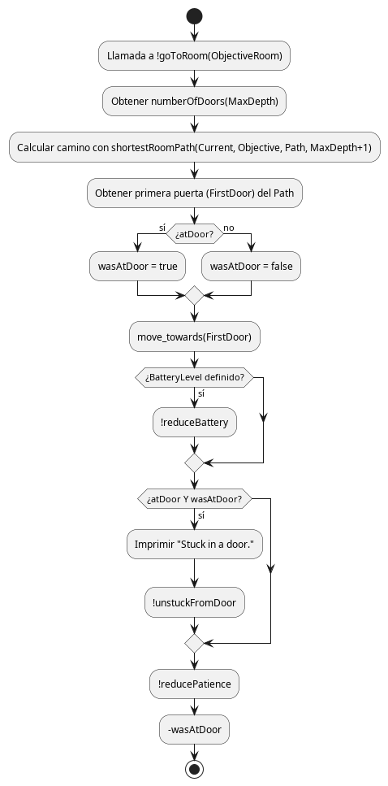
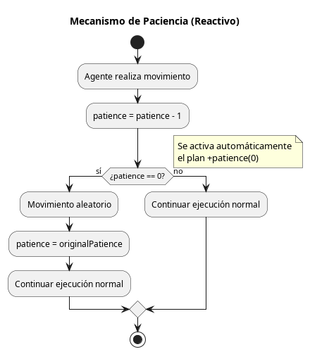
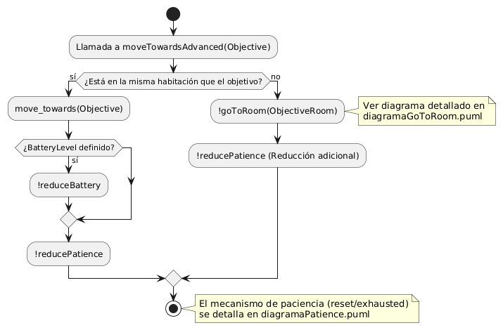
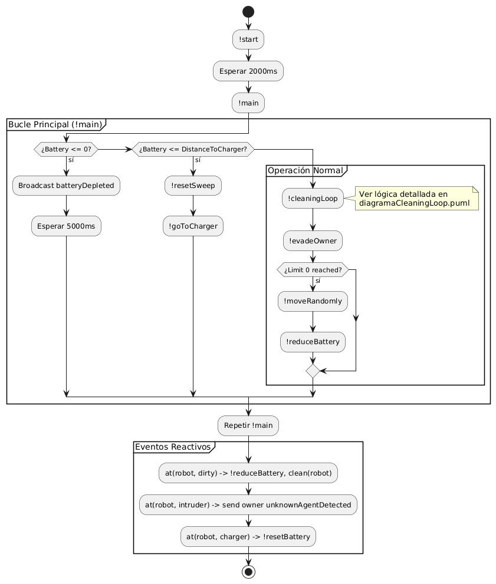
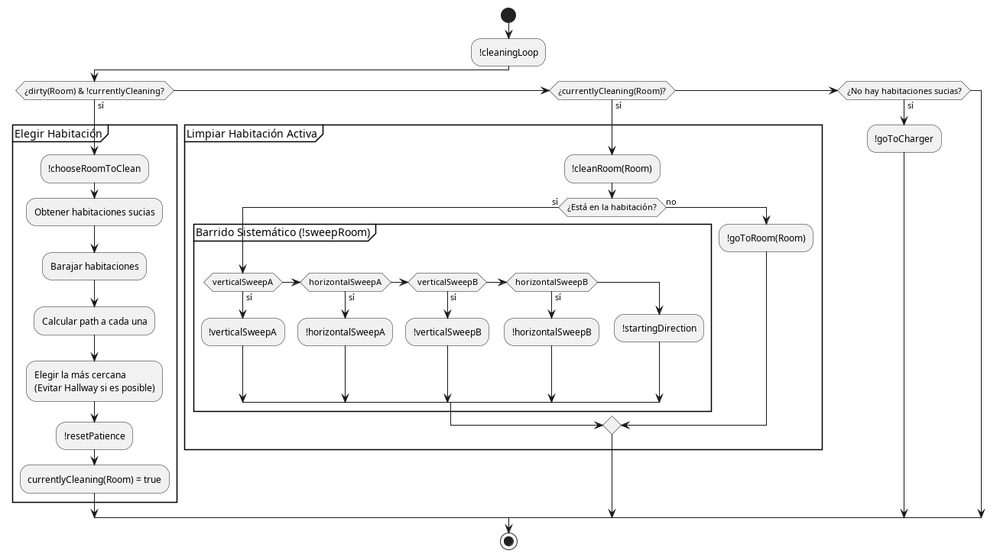
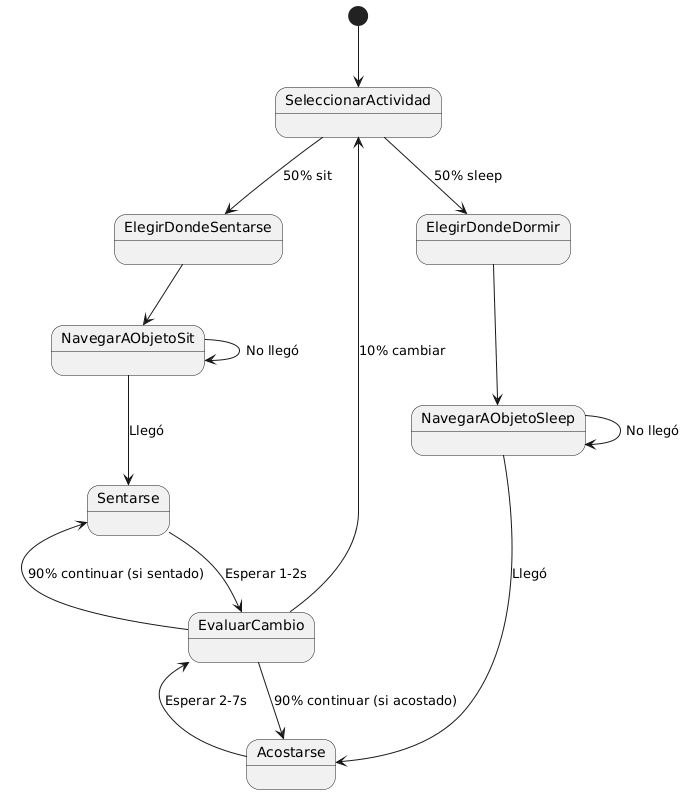

# Informe Técnico: Sistema Multi-Agente de Limpieza Doméstica

## Introducción

Este documento analiza el comportamiento de un sistema multi-agente desarrollado en Jason (AgentSpeak) que simula un entorno doméstico. El sistema está compuesto por un robot de limpieza autónomo que debe mantener la casa limpia mientras interactúa con agentes humanos (propietario e intruso) que se mueven libremente por el hogar.

El problema que se aborda es el siguiente: un robot debe recorrer todas las habitaciones de una casa y limpiarlas completamente, mientras que los habitantes se desplazan de manera aparentemente aleatoria, sentándose, durmiéndose y realizando otras actividades cotidianas. El robot detecta la suciedad en las celdas que ocupa mediante la percepción `at(robot, dirty)` y debe garantizar que cada habitación quede completamente limpia al salir de ella.

## Arquitectura del Sistema

El sistema se compone de siete archivos principales que definen el comportamiento de la lógica de los agentes:

- [`movement.asl`](../src/agt/movement.asl) es un módulo compartido que proporciona las funcionalidades básicas de navegación. Contiene la representación del entorno (cómo están conectadas las habitaciones), algoritmos de planificación de rutas y mecanismos para evitar que los agentes se queden atascados.

- [`robot.asl`](../src/agt/robot.asl) define el comportamiento del robot limpiador, incluyendo la estrategia de selección de habitaciones a limpiar, el algoritmo de barrido sistemático de cada habitación y la lógica para evitar molestar al propietario.

- [`owner.asl`](../src/agt/owner.asl) simula el comportamiento humano del dueño de la casa, que elige aleatoriamente entre diversas actividades como sentarse en diferentes muebles o acostarse en las camas.

- [`mapping.asl`](../src/agt/mapping.asl) es un módulo que proporciona funcionalidades para mapear la casa, obteniendo las conexiones de habitaciones contiguas.

- [`sweep.asl`](../src/agt/sweep.asl) es un módulo que proporciona funcionalidades para recorrer las habitaciones al limpiarlas. Incorpora 4 tipos de barrido diferentes cambiando su dirección, para asegurar la limpieza de las habitaciones.

- [`intruder.asl`](../src/agt/intruder.asl) simula el comportamiento de un extraño en la casa, que puede ser hostil o conocido, y que en base a esto, tendrá comportamientos distintos.

- [`beeMovie.asl`](../src/agt/beeMovie.asl) el owner ha trabajado demasiado con Jason y a veces dice frases aleatorias de la película.

Para que funcionen estos agentes con su entorno, se necesita la siguiente configuración de carpetas:

```text
domestic_robot/
│ ├── docs/
│ │   └── README.md
│ ├── DomesticRobot.mas2j
│ ├── lib/
│ │   └── All the .jar dependencies
│ └── src/
│     ├── agt/
│     │   ├── beeMovie.asl
│     │   ├── intruder.asl
│     │   ├── mapping.asl
│     │   ├── movement.asl
│     │   ├── owner.asl
│     │   ├── robot.asl
│     │   └── sweep.asl
│     └── main/
│     │   └── env/
│     │       └── domotic/
│     │           ├── HouseEnv.java
│     │           ├── HouseModel.java
│     │           └── HouseView.java
│     └── resources/
│         └── doc/
│             └── All the visual files
```

## Módulo de Movimiento y Navegación

El módulo de movimiento actúa como biblioteca base para todos los agentes del sistema. La representación del entorno se basa en conexiones entre habitaciones mediante predicados del tipo `connect(habitacion1, habitacion2, puerta)`. Por ejemplo, `connect(kitchen, hall, doorKit1)` indica que la cocina y el hall están conectados a través de la puerta doorKit1. Estos connect que se obtienen permiten a los diferentes agentes realizar las rutas a correspondientes habitaciones que precisen ir según la necesidad.

### Mapeo de la Casa

Para la obtención de los predicados de tipo `connect(habitacion1, habitacion2, puerta)`, se lleva a cabo el mapeo de la casa. Para ello, tanto el owner como el robot realizan las siguientes acciones:

1. Obtener todos los objetos de la casa y filtrar las puertas si contienen el fragmento o secuencia de string `“door”`, para adicionarlas a una listado de puertas que tienen que descubrir.

2. Obtener los objetos de la habitación donde se encuentra el agente mediante la creencia `atRoom(Object, Room)` e identificar cuáles de estos objetos corresponden a puertas.

3. Dependiendo si el agente ya ha visitado la puerta, se dan dos casuísticas:
   1. Si no la ha visitado, entonces se mueve a ella mediante el uso de `move_towards()`.

   2. Si ya la ha visitado, se va al pasillo y se mueve a otras puertas que sigan en la lista de puertas que no han sido visitadas aún.

4. El agente cruza la habitación para saber que la puerta visitada conecta dos habitaciones contiguas y adiciona la creencia `connect(habitacion1, habitacion2, puerta)`.

5. El agente responsable de descubrir cada puerta en su momento, realiza un broadcast para comunicar a todos los agentes la conexión obtenida.

### Planificación de Rutas

La planificación de rutas se realiza mediante dos predicados principales.

#### `findPathRoom`

El predicado `findPathRoom` implementa una búsqueda en profundidad limitada que explora recursivamente las conexiones entre habitaciones. Este predicado es especialmente interesante porque mantiene una lista de puertas visitadas para evitar ciclos, asegurando que el agente no cruce la misma entrada repetidamente en un solo trayecto. La regla funciona identificando primero una conexión válida entre la habitación actual y una adyacente a través de una puerta específica. Posteriormente, se verifica que dicha puerta no haya sido transitada previamente y que el límite de profundidad permitido, controlado por la variable `N1`, sea aún superior a cero. Si estas condiciones se cumplen, se realiza una llamada recursiva que añade la puerta a la lista de elementos visitados y reduce el contador de profundidad.

Finalmente, la ruta completa se construye mediante la concatenación de la puerta actual con el subcamino encontrado, devolviendo al agente una secuencia lógica de movimientos para alcanzar su destino.

Este enfoque estructurado permite que los agentes naveguen por la casa de forma segura, respetando los límites de exploración y optimizando el descubrimiento de rutas viables hacia las habitaciones objetivo.

```prolog
findPathRoom(Current, Target, Visited, Path, MaxDepth)
 :-
   connect(Current, NextRoom, Door)
  &
   minusOne(MaxDepth, N1)
  &
   N1 > 0
  &
   not .member(Door, Visited)
  &
   findPathRoom(NextRoom, Target, [Door|Visited], SubPath, N1)
  &
   Path = [Door|SubPath].
```

#### `shortestRoomPath`

El predicado `shortestRoomPath` implementa una estrategia de búsqueda de profundidad iterativa que optimiza la navegación al explorar el entorno en capas concéntricas. Mediante el uso del operador de disyunción, el sistema prioriza sistemáticamente la búsqueda en profundidades menores `N-1` antes de intentar el límite actual, lo que garantiza que el camino devuelto sea siempre el más corto posible entre dos habitaciones.

Esta estructura recursiva se apoya en la regla `minusOne` para decrementar el nivel de exploración hasta agotar las posibilidades dentro del rango permitido. El control de seguridad `MaxDepth > 0` previene ciclos infinitos y asegura que la búsqueda se detenga si se supera el número total de conexiones detectadas en la casa. Una vez hallada la ruta óptima, el predicado delega en `findPathRoom` la construcción de la lista secuencial de puertas que el agente debe cruzar para alcanzar su objetivo.

```prolog
shortestRoomPath(Current, Target, Path, MaxDepth)
 :-
   MaxDepth > 0
  &
   (
    (
     minusOne(MaxDepth, N1)
    &
     shortestRoomPath(Current, Target, Path, N1)
    )
   |
    findPathRoom(Current, Target, [], Path, MaxDepth)
   ).
```

### Navegación entre Habitaciones

La navegación entre habitaciones se gestiona mediante el plan `goToRoom`, que calcula el camino óptimo y luego realiza un único movimiento hacia la primera puerta del camino. Este plan no es cíclico: se invoca repetidamente desde el bucle del agente que lo llama, pero cada invocación realiza solo un paso de movimiento.

Un aspecto crítico de la navegación es la detección y resolución de atascos. Si el agente se encuentra en una puerta durante dos ciclos consecutivos (lo que se detecta mediante la variable temporal `wasAtDoor`), se considera que está atascado y ejecuta movimientos aleatorios hasta liberarse.



### Mecanismo de Paciencia

Un elemento clave para la robustez del sistema es el mecanismo de paciencia. Cada agente mantiene un contador (`patience`) que se decrementa con cada movimiento. Cuando este contador llega a cero, se activa automáticamente un plan reactivo (mediante `+patience(0)`) que ejecuta un movimiento aleatorio y reinicia el contador. Este mecanismo funciona de forma similar a como se activan otros planes reactivos como `+at(robot, dirty)`.

El contador de paciencia se reinicia en dos situaciones: automáticamente cuando llega a cero tras el movimiento aleatorio, o manualmente cuando el robot o el owner alcanzan sus objetivos y llaman a `!resetPatience`.



### Movimientos Especiales para el Barrido

Para el robot, que debe barrer habitaciones sin salir de ellas, existen variantes especiales de los movimientos básicos: `moveUpNoExit`, `moveDownNoExit`, `moveLeftNoExit` y `moveRightNoExit`. Estas versiones verifican después de cada movimiento si el agente ha salido de la habitación o está en una puerta, y en ese caso deshacen el movimiento. Además, actualizan los contadores de posición (`height` y `width`) que el robot usa para controlar el barrido sistemático.



## Agente Robot

El robot opera mediante un bucle principal que ejecuta continuamente dos objetivos: `cleaningLoop` para la limpieza y `evadeOwner` para evitar al propietario. Este ciclo se repite indefinidamente, permitiendo que el robot responda de manera reactiva a los cambios en el entorno.

La estrategia de limpieza del robot es sofisticada y se divide en varias fases. Primero, el robot debe elegir qué habitación limpiar. Para ello, obtiene la lista de todas las habitaciones sucias y calcula el camino más corto a cada una de ellas. La selección no es trivial: el robot prioriza habitaciones que no sean el pasillo (a menos que sea la única opción), ya que el pasillo se limpia naturalmente al transitar por él. El código que implementa esta lógica itera sobre las habitaciones barajadas y mantiene la mejor opción encontrada:

```prolog
for ( .member(Room, ShuffledRooms) ) {
 ?shortestRoomPath(CurrentRoom, Room, Path, MaxDepth);
 .length(Path, PathLength);
 ?bestRoom(CurrentBest, BestLen);
 
 if ((PathLength < BestLen | CurrentBest = hallway) & 
     (not Room = hallway | CurrentBest = nil)) {
  -bestRoom(_,_);
  +bestRoom(Room, PathLength);
 };
}
```

Una vez que el robot llega a la habitación elegida, comienza el proceso de barrido sistemático. Este es quizás el aspecto más técnico del comportamiento del robot. El barrido se realiza en cuatro fases distintas que garantizan que cada celda de la habitación sea visitada al menos una vez después de bajar a la parte inferior izquierda:

- La primera fase (Vertical A) consiste en subir/bajar por las columnas de la habitación hacia la derecha.
- La segunda fase (Horizontal B) continúa desde donde terminó la anterior, moviéndose horizontalmente y limpiando fila por fila.
- La tercera fase (Vertical B) invierte el patrón, columna por columna mientras se mueve hacia la izquierda.
- Finalmente, la fase Horizontal A completa el barrido moviéndose hacia la izquierda fila por fila.

El robot mantiene varias variables de estado para controlar este proceso: `height(X)` y `width(Y)` rastrean la posición relativa en el barrido, `bottomReached` y `leftReached` marcan el fin de las fases iniciales de posicionamiento, y las variables `movingUp`, `movingDown`, etc., indican la dirección actual del movimiento. Los flags `verticalSweepA`, `horizontalSweepB`, etc., determinan qué fase del barrido está activa.

Además de la limpieza, el robot reacciona a percepciones del entorno mediante planes activados por la adición de creencias. Cuando detecta `at(Me, dirty)`, limpia inmediatamente esa celda. Si detecta `at(Me, intruder)`, emite una alerta y envía un mensaje al propietario.

La evasión del propietario es un comportamiento interesante que añade "cortesía" al robot. El sistema cuenta cuántas veces consecutivas el robot coincide con el dueño en la misma celda. Tras 5 coincidencias, el robot se disculpa y realiza un movimiento aleatorio para salir del camino. Este contador se reinicia cuando el robot ya no está cerca del propietario.





### Sistema de Batería y Gestión del Cargador

Además de los comportamientos de limpieza y evasión, el robot incorpora un sistema de batería que gestiona su autonomía energética. La batería se inicia con 400 unidades y se decrementa en 1 unidad por cada movimiento realizado, lo que obliga al robot a monitorizar su estado y planificar el regreso al cargador cuando sea necesario.

### Detección de Batería Baja y Decisión de Regreso

Para determinar cuándo debe volver al cargador, el robot utiliza una heurística que asigna a cada habitación un valor de [umbral de batería](./size.csv). Este valor representa el consumo estimado de batería necesario para llegar al cargador desde esa habitación en el peor caso y se calcula como: `+chargerDistance(Y*(L+1)).`, donde `Y` es el tamaño del grid y `L` es la longitud del camino que ha tomado.

Cuando el robot detecta que su batería restante es igual o inferior al umbral correspondiente a la habitación en la que se encuentra, entonces interrumpe el proceso de barrido y se activa un plan de regreso al cargador. Este enfoque garantiza que el robot nunca se quede sin energía antes de alcanzar el punto de recarga.

#### Limitaciones del Enfoque

La estrategia no es óptima, ya que el robot sólo conoce la habitación actual (no la celda exacta dentro de ella). Por ello, el umbral utilizado es conservador, calculado para cubrir la máxima distancia posible dentro de la habitación hasta el cargador. Aunque esto puede llevar a un regreso anticipado en algunos casos, asegura la fiabilidad del sistema. En la práctica, el consumo real de batería durante el regreso es significativamente menor que el umbral en la mayoría de las situaciones.

[Este](./perfect.csv) sería el mapa del coste óptimo de batería que tendrá el robot dependiendo de el recuadro donde se encuentre.

Este es el costo que le atribuímos a cada una de las casillas del entorno, le damos el mismo coste a todas las casillas de cada habitación. Hemos calculado la pérdida de eficiencia y sería solamente un `6%` con respecto a la ruta ideal.

#### Eficiencia Energética

Según los datos del mapeo, el robot gasta en promedio solo un `6,23%` de su batería total (aproximadamente 25 unidades) en el trayecto de regreso al cargador. Esto demuestra que, a pesar de la aproximación no óptima, el sistema es eficiente y minimiza el tiempo de inactividad por recarga. El resto de la batería se dedica a tareas de limpieza y navegación, optimizando la productividad del robot.

#### Integración con el Comportamiento Existente

El monitoreo de la batería se ejecuta en paralelo a los bucles de limpieza y evasión, añadiendo una capa adicional de autonomía. Cuando se activa el plan de regreso al cargador, el robot interrumpe temporalmente la limpieza y navega hacia la estación de carga. Una vez recargado, reinicia sus actividades normales desde el punto más cercano a la última habitación limpiada.

### Detección Intruso

Otra de las funcionalidades que implementa el robot es alertar al owner en el caso de si se encuentra a un intruso en la casa. Si el robot se encuentra al lado de un agente distinto al owner (posible intruso), alertará al propietario de su presencia y la habitación donde se encuentra mediante la sentencia:

`.send(owner, tell, unknownAgentDetected(intruder, Room)).`

## Agente Intruder

El agente Intruder (intruso/invitado) simula la presencia de un tercer individuo en el entorno doméstico, cuya naturaleza, amistosa o hostil, se determina de forma aleatoria al inicio de su ejecución. Este agente está diseñado para añadir una capa de dinamismo e imprevisibilidad al sistema, aunque en la implementación actual presenta limitaciones significativas que restringen su funcionalidad.

### Determinación del Rol: Invitado (Friendly) vs. Intruso (Hostile)

Al iniciar la ejecución del agente, se establece de forma automática su rol dentro del sistema. Esta decisión se toma durante la ejecución del objetivo `!init`, el cual incluye la siguiente lógica:

Se genera un valor aleatorio X entre 0 y 1 utilizando la acción `.random(X)`. Este valor se utiliza como criterio para asignar el rol del agente:

- Si X < 0.5, el agente se considera un invitado (`friendly`). En este caso, se añade la creencia `friendly`.
- Si X >= 0.5, el agente se clasifica como un intruso (`hostile`). En este caso, se añade la creencia `hostile`.

### Comportamiento Previsto según el Rol

El diseño conceptual del agente contempla dos patrones de comportamiento distintos basados en el rol asignado:

#### Comportamiento como Invitado (Friendly)

El intruso, cuando es amistoso, su ciclo principal estaría diseñado para:

1. Recibir un saludo por parte del owner, el cual selecciona una habitación que disponga de un objeto en el que pueda descansar y se lo comunica al intruso.

2. Navegar hasta esa habitación utilizando el módulo compartido de movimiento.

3. Una vez en la habitación, interactuar con objetos disponibles (sentarse en sillas, sofás, etc.).

4. Permanecer en ese estado durante un tiempo aleatorio antes de seleccionar una nueva actividad.

Este comportamiento simula a un invitado que realiza visitas tranquilas sin interferir con las actividades domésticas.

#### Comportamiento como Intruso (Hostile)

Como intruso, el agente debería mostrar un comportamiento que afecte al normal funcionamiento del hogar. Entre los comportamientos previstos podrían incluirse:

1. Movimiento errático por la casa, accediendo a habitaciones de forma impredecible.

2. Activación de mecanismos de alarma que requieran la intervención del propietario.

### Limitación Técnica Actual: Problema de Localización

En la implementación actual se ha predefinido que el intruso se dirija directamente al owner tanto para el caso que sea hostil como que no. Esto se ha hecho para facilitar la interacción, aunque sea forzada, para que se pueda activar alguno de los escenarios anteriormente descritos.

El problema radica en el mecanismo de generación del agente:

- El intruder aparece aleatoriamente en una habitación al inicio de la simulación.

- No existe un mecanismo para que el agente detecte automáticamente en qué habitación se encuentra.

- Sin la creencia `atRoom(Room)`, el módulo de movimiento compartido puede no funcionar, ya que todos los algoritmos de navegación dependen de conocer la ubicación actual.

Consecuencia:

Los planes de navegación requieren la creencia `atRoom(Room)` para calcular rutas. Los comportamientos reactivos que podrían activarse por percepciones del entorno no se disparan porque el agente no puede interpretar correctamente su posición relativa.

En su lugar, se ha introducido forzosamente las creencias `atRoom(Room)` de todas las habitaciones para que las posea el intruso, así como las conexiones entre todas las habitaciones, y que el intruso se dirija directamente al owner, pese a que en la mayoría de los casos queda bloqueado debido a la presencia de la pared o de algún objeto. Esto no se puede solucionar sin saber en qué habitación se encuentra el intruso para poder hacer que se dirija a las puertas.

### Estructura del Código y Funcionalidad No Operativa

El código del agente Intruder sigue la misma estructura modular que el resto del sistema, incluyendo el módulo de movimiento ([movement.asl](../src/agt/movement.asl)). Contiene:

- Plan de inicialización (`!init`): Establece el rol aleatorio y muestra mensajes informativos.

- Ciclo principal (`!main`):

Para modo friendly: Intenta ejecutar `!goingToSit(Room)`

Para modo hostile: En versiones de prueba incluye `move_towards(owner)`, y sí que se desplazaba hacia el owner y este interactuaba con el de la manera que se pedía.

### Solución Técnica Requerida

Para que el agente Intruder funcione como se concibió originalmente, se necesitarían las siguientes modificaciones:

1. Mecanismo de autodetección de ubicación: Añadir en `!init` una llamada al entorno para obtener la habitación inicial, similar a lo que hacen otros agentes durante el mapeo.

2. Sistema de actualización de ubicación: Implementar planes reactivos para `+atRoom(Room)` que mantengan actualizada la creencia de posición cuando el agente cruce puertas.

3. Comportamientos específicos implementados: Desarrollar los planes concretos para los modos friendly y hostile, más allá del esqueleto actual.

## Agente Owner

El agente Owner representa al propietario de la vivienda y su comportamiento está pensado para simular acciones humanas sencillas dentro del entorno. El agente alterna entre actividades cotidianas y reacciones ante eventos que considera importantes, como la aparición de un intruso o problemas con la batería del robot.

El funcionamiento del agente se basa en un bucle principal que se ejecuta de forma continua y evalúa distintas condiciones para decidir qué acción realizar en cada momento.



### Comportamiento general del Owner

El comportamiento del owner sigue un orden de prioridad claro:

1. Si no ocurre nada relevante, realiza actividades cotidianas.

2. Si el robot necesita ser recargado, intenta ayudarle.

3. Si se detecta un agente desconocido, se va a comprobar quién es.

4. Si encuentra a un intruso hostil, el owner huye.

5. Si encuentra a un intruso amigable, lo saluda y lo manda a sentarse.

### Actividades Cotidianas

Cuando no hay eventos críticos, el owner elige de forma aleatoria qué hacer. Las dos actividades principales son:

- Sentarse, eligiendo entre el sofá o distintas sillas (49.5% de probabilidad).
- Dormir, eligiendo una de las camas disponibles (49% de probabilidad).
- Decir una frase del guión de la película [`Bee Movie`](../src/agt/beeMovie.asl) (0.5% de probabilidad)

Una vez seleccionado el objetivo, el agente se desplaza, y al llegar al objetivo, se ejecuta la acción correspondiente durante un tiempo aleatorio:

- Entre 1 y 2 segundos en el caso de sentarse.

- Entre 2 y 7 segundos en el caso de dormir.

Después de completar la acción, existe una probabilidad del 10% de que el owner decida dejar lo que estaba haciendo y elegir una nueva actividad. Esto evita que el agente se quede “bloqueado” en una misma acción durante toda la simulación.

### Detección de Agentes Desconocidos

Cuando el owner detecta un agente desconocido en su misma posición, registra esta información junto con la habitación en la que ocurre. A partir de ese momento, su objetivo principal pasa a ser acercarse a dicho agente para comprobar de quién se trata.

Este comportamiento simula una reacción básica de curiosidad o vigilancia ante la presencia de alguien que no pertenece al entorno habitual.

### Interacción con el Agente Desconocido

Al llegar a la habitación donde se encuentra el agente, el owner intenta comunicarse con él para determinar si es amistoso o no. Para ello, envía un mensaje solicitando una respuesta mediante `.send(Agent, askOne, friendly, Response)`.

- Si el agente resulta ser amistoso, el owner hará lo siguiente:

  - Cancelar cualquier alerta activa.

  - Elige aleatoriamente un mueble donde el invitado pueda sentarse.

  - Obtiene la habitación asociada a dicho mueble.

  - Comunica al agente qué habitación puede utilizar.

- Si el agente resulta ser hostil, lo que hará es:

  - Se activa una alerta.

  - El owner empieza a huir a otra habitación.
  
  - El owner mueve muebles en su huida.

### Comportamiento de Huida ante Intrusos

Cuando se detecta un intruso, el owner interrumpe cualquier otra acción y ejecuta un plan para ponerse a salvo. Para ello:

1. Obtiene la lista de habitaciones del entorno.

2. Calcula la distancia a cada una mediante planificación de caminos.

3. Selecciona la habitación más alejada de su posición actual.

4. Se desplaza hacia ella como zona segura.

Una vez alcanza la habitación elegida, se elimina el estado de intrusión y el owner puede volver a su comportamiento normal.

### Interacción con el Entorno durante la Huida

El sistema incorpora un mecanismo para mover muebles que se activa cuando se detecta la presencia de un intruso en el entorno.

El movimiento de los muebles se gestiona mediante el plan que se activa cuando el agente se encuentra en la misma posición que un objeto (`at(Me, F)`) y existe la creencia `intruderDetected(_)`, lo que indica que un intruso ha sido detectado en alguna habitación. Es decir, el owner desplaza cualquier objeto al encontrarse con él mientras huye del intruso.

Una vez cumplidas estas condiciones, el agente genera un valor aleatorio mediante la acción `.random(R)`, que se utiliza para decidir la dirección en la que se moverá el mueble. Este valor se divide en cuatro rangos, cada uno con una probabilidad del 25%:

- Si R < 0.25, el mueble se desplaza hacia arriba (`moveObjectUp(F)`).

- Si 0.25 ≤ R < 0.5, el mueble se desplaza hacia abajo (`moveObjectDown(F)`).

- Si 0.5 ≤ R < 0.75, el mueble se desplaza hacia la izquierda (`moveObjectLeft(F)`).

- Si R ≥ 0.75, el mueble se desplaza hacia la derecha (`moveObjectRight(F)`).

### Gestión de la Batería del Robot

El owner también recibe mensajes del robot relacionados con su batería. Cuando el robot notifica que su batería se ha agotado, el owner activa un comportamiento de asistencia:

- Se desplaza hacia la posición del robot.

- Intenta recogerlo.

- Se dirige hacia el cargador.

Este comportamiento no siempre se completa correctamente debido a las limitaciones del modelo, pero refleja la intención de cooperación entre ambos agentes.

Cuando el robot informa de que la batería ha sido recargada, el owner elimina el estado de ayuda y continúa con sus actividades normales.

## Retos y problemas encontrados

El intruso no tiene conocimiento por parte del entorno sobre en qué habitación se encuentra. Eso limita su capacidad de moverse puesto que no sabe cuál es su puerta más cercana y el `move_towards` hace que se dirija en línea recta al objetivo y el intruso choca con la pared.

Al desaparecer el intruso, se produce un error de java de `null pointer exception` del objeto `r1`.

Como la desaparición del intruso no consiste en eliminar el hilo y volver a crearlo, si no que simplemente transporta el intruso a las coordenadas (-1,-1), no se puede simplemente hacer que la naturaleza del intruso cambia al reaparecer entre conocido o desconocido porque el init solo se ejecuta una vez al crear el thread. En su lugar, hay que meter un contador de tiempo que alterna entre uno y otro.

## Conclusiones

El sistema demuestra cómo la arquitectura BDI (Beliefs-Desires-Intentions) de Jason permite implementar comportamientos complejos de manera declarativa. El diseño modular, con el módulo de movimiento compartido, facilita la reutilización de código y simplifica el mantenimiento.

El robot implementa un comportamiento determinista y complejo para cumplir su objetivo de limpieza exhaustiva, mientras que el propietario exhibe un comportamiento estocástico que añade imprevisibilidad al entorno. Esta combinación crea un sistema dinámico donde el robot debe adaptarse constantemente a las condiciones cambiantes.
